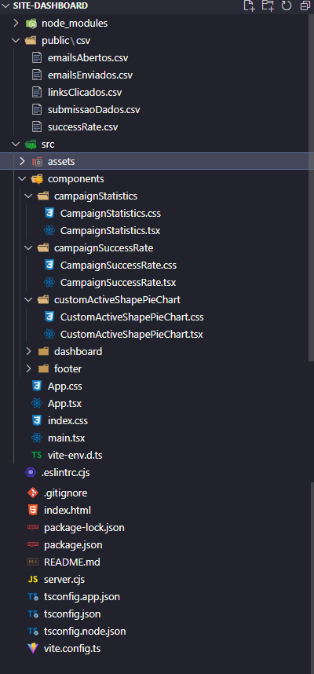

# Dashboard

Esta aplicação permite a leitura de um arquivo CSV e a plotagem de gráficos a partir dos dados contidos no arquivo. Foi desenvolvida utilizando HTML, CSS, JavaScript, TypeScript, React e Vite.

## Funcionalidades

- Plotagem de gráficos interativos a partir de dados CSV.

## Tecnologias Utilizadas

- **HTML**: Estruturação da página.
- **CSS**: Estilização da página.
- **JavaScript**: Manipulação do DOM e integração com bibliotecas de gráficos.
- **TypeScript**: Desenvolvimento de lógica de aplicação com tipagem estática.
- **React**: Biblioteca para construção da interface de usuário.
- **Vite**: Ferramenta de build rápida e leve para desenvolvimento front-end.
- **Express**: Servidor para servir os arquivos estáticos em produção.

## Pré-requisitos

Para executar esta aplicação localmente, você precisa ter instalado:

- Node.js
- npm (Node Package Manager)

## Estrutura do Diretório


- **public/csv**: Contém arquivos .csv para plotagem dos gráficos.
- **src/**: Contém os arquivos fonte da aplicação.
  - **components/**: Contém os componentes React.
    - **CampaignStatistics.tsx**: Componente para exibir estatísticas da campanha.
    - **CampaignSuccessRate.tsx**: Componente para exibir a taxa de sucesso da campanha.
    - **CustomActiveShapePieChart.tsx**: Componente personalizado para gráfico de setor.
  - **App.tsx**: Componente principal da aplicação.
  - **main.tsx**: Ponto de entrada da aplicação React.
- **index.html**: Arquivo HTML principal.
- **package.json**: Informações do projeto e dependências.
- **tsconfig.json**: Configurações do TypeScript.
- **vite.config.ts**: Configurações do Vite.
- **server.cjs**: Servidor Express para servir os arquivos estáticos em produção.
## Instalação

1. Clone o repositório:

```bash
https://github.com/EduardoRibeiroIX/dashboard.git
cd site-dashboard
```
2. Instale as dependências:
```bash
npm install
```
3. Inicie o servidor de desenvolvimento:
```bash
npm run dev
```
## Deploy

Para fazer o deploy da aplicação em um ambiente de produção, siga os seguintes passos:

1. Compile os arquivos para produção:
```bash
npm run build
```
2. Certifique-se de que os arquivos compilados estão na pasta 'dist'.

3. Execute o servidor Express para servir os arquivos estáticos:
```bash
node server.cjs
```
## Licença

Este projeto está licenciado sob a MIT License.